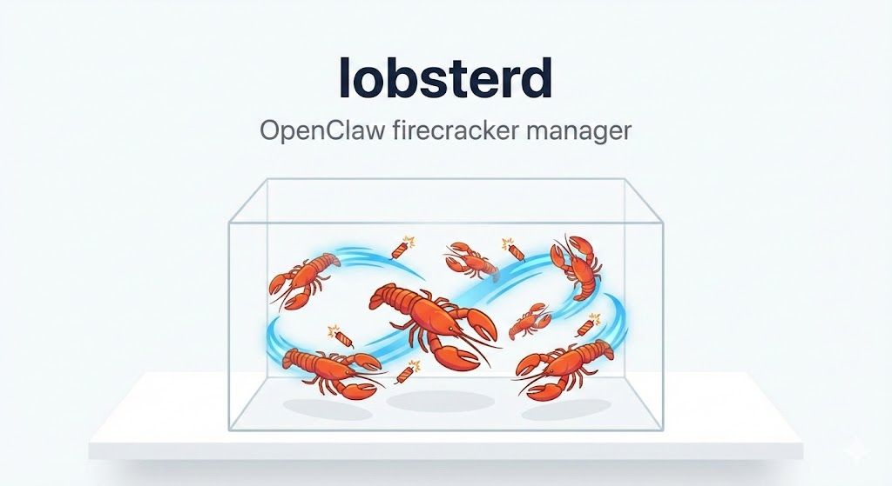

# lobsterd

Firecracker MicroVM Tenant Orchestrator. Spawns lightweight VMs with isolated
networking, per-tenant overlay filesystems, and an OpenClaw gateway in each guest.

## Prerequisites

- Linux with KVM enabled (`/dev/kvm` must be accessible)
- Root access, x86_64 architecture
- [Bun](https://bun.sh) runtime

## Setup

```bash
bun install
sudo lobsterd init
```

`init` will prompt you for a domain (default `lobster.local`) and offer to
download/install anything that's missing: Firecracker + jailer, the vmlinux
kernel, the Alpine rootfs, and Caddy.

This creates:
- `/etc/lobsterd/config.json` -- main configuration
- `/etc/lobsterd/registry.json` -- tenant registry
- `/var/lib/lobsterd/overlays/` -- per-tenant overlay images
- `/var/lib/lobsterd/sockets/` -- Firecracker API sockets

## Usage

```bash
# Spawn a new tenant
sudo lobsterd spawn <name>

# Remove a tenant
sudo lobsterd evict <name>

# Health-check and repair tenants
sudo lobsterd molt [name]

# Start the watchdog daemon
sudo lobsterd watch [-d]

# TUI dashboard (IP, PID, memory, health)
sudo lobsterd tank

# Machine-readable tenant list
sudo lobsterd tank --json

# Print gateway token for a tenant
sudo lobsterd token <name>

# Stream tenant logs
sudo lobsterd logs <name>

# Snapshot a tenant's overlay
sudo lobsterd snap <name>

# Start the REST API server
sudo lobsterd buoy
```

## REST API (buoy)

`lobsterd buoy` starts a local HTTP server that mirrors the CLI. A bearer token
is auto-generated on first run and stored in `/etc/lobsterd/config.json`.

```bash
sudo lobsterd buoy [--port 7070] [--host 127.0.0.1]
```

The server prints the token on startup — pass it as `Authorization: Bearer <token>`.

### Endpoints

```
GET  /health                  # server status (public, no auth)
GET  /openapi.json            # OpenAPI 3.1 spec (public)

GET  /tenants                 # list all tenants with health state
POST /tenants                 # spawn a new tenant
DELETE /tenants/{name}        # evict a tenant

POST /tenants/{name}/molt     # health-check and repair
POST /tenants/{name}/snap     # snapshot overlay to tarball

GET  /tenants/{name}/token    # get gateway token
GET  /tenants/{name}/logs     # fetch tenant logs
```

### Examples

```bash
TOKEN="<your-token>"

# List tenants
curl -H "Authorization: Bearer $TOKEN" http://localhost:7070/tenants

# Spawn a tenant
curl -X POST -H "Authorization: Bearer $TOKEN" \
  -H "Content-Type: application/json" \
  -d '{"name": "my-tenant", "apiKey": "sk-..."}' \
  http://localhost:7070/tenants

# Health-check a tenant
curl -X POST -H "Authorization: Bearer $TOKEN" \
  http://localhost:7070/tenants/my-tenant/molt

# Evict a tenant
curl -X DELETE -H "Authorization: Bearer $TOKEN" \
  http://localhost:7070/tenants/my-tenant
```

### Agent lockdown

Agent lockdown is enabled by default. This adds iptables OUTPUT rules that
restrict access to the guest agent ports (52/53) to **root-only** processes on
the host. Even if a non-root user discovers a tenant's guest IP, they cannot
query the agent, inject secrets, or control the VM — the kernel drops the packet
before it leaves the host. This closes the last local privilege escalation path
from unprivileged host users to the guest control plane.

## Architecture

Each tenant gets:
- A Firecracker microVM (2 vCPU, 1024MB RAM by default)
- A /30 subnet with a dedicated TAP device and iptables NAT
- An overlay ext4 filesystem layered on top of the shared read-only rootfs
- A lobster-agent (TCP on port 52/53) for host-to-guest communication
- A Caddy reverse-proxy route at `<name>.<domain>` (default `lobster.local`)

Networking uses kernel `ip=` boot parameter for static configuration inside the
guest and TAP + MASQUERADE on the host side. The agent listens for JSON-RPC
messages over TCP to inject secrets, launch the OpenClaw gateway, stream logs,
and handle shutdown.

### VM isolation

Every VM runs inside the Firecracker **jailer**, which provides per-tenant
UID/GID, a chroot filesystem, PID/mount/network namespaces, and a default
seccomp BPF filter (~35 allowed syscalls). Cgroup v2 resource limits cap memory
at 1.5x the VM's configured RAM and CPU quota proportional to its vCPU count,
preventing any single tenant from starving the host. The vsock device has been
removed entirely to eliminate virtio-vsock emulation as a guest-reachable attack
surface, leaving only four virtio devices (block x2, net, keyboard).

### Network isolation

Tenant traffic flows through dedicated `LOBSTER-INPUT` and `LOBSTER-FORWARD`
iptables chains, inserted at position 1 in the built-in INPUT and FORWARD
chains. Per-tenant rules block guest-to-host access, RFC 1918 ranges
(10.0.0.0/8, 172.16.0.0/12, 192.168.0.0/16), and link-local (169.254.0.0/16).
Only return traffic and inbound connections to the tenant's gateway port are
accepted.

DNAT rules in PREROUTING exclude `10.0.0.0/8` as a source, preventing
cross-tenant access through host-side port forwarding. Each tenant is limited to
1024 concurrent connections via `connlimit` to prevent conntrack table
exhaustion. IPv6 is disabled on all TAP devices. Network throughput is rate
limited to 10 Mbps RX/TX at 1K ops/s; disk I/O is limited to 50 MB/s at 5K
ops/s.

### Guest hardening

All tenants share a read-only Alpine 3.20 rootfs with per-tenant writable
overlays via overlayfs. The rootfs is stripped after build: the apk package
manager, curl, git, wget, and compilers are removed, along with busybox applets
useful for reconnaissance or exploitation (nc, telnet, ftp, tftp, httpd,
traceroute, nslookup). The root account is locked and the serial console is
disabled (`8250.nr_uarts=0` in kernel boot args, getty removed from inittab).

### Agent auth

The lobster-agent inside each VM authenticates host commands using a per-tenant
UUID token passed via the kernel command line. Authentication uses timing-safe
comparison and is fail-closed: if the token is missing or invalid, all requests
are rejected. Messages are capped at 1 MB to prevent memory exhaustion.

### TLS termination

Caddy terminates TLS for all tenant routes using ACME or bundled Cloudflare
origin certificates. The origin private key is stored with `0640 root:caddy`
permissions so only root and the Caddy process can read it.

See [SECURITY.md](SECURITY.md) for the full threat model, architectural limits
of KVM-based isolation, and recommended host configuration (SMT, KSM, conntrack
tuning).

## File layout

```
src/
  index.tsx           CLI entry point (commander)
  commands/           init, spawn, evict, molt, snap, watch, tank, logs
  reef/               REST API server (Hono + OpenAPI)
  system/             firecracker API, networking, caddy, overlay images, agent TCP
  config/             zod schemas, defaults, JSON loader with file locking
  checks/             VM and network health checks
  repair/             VM and network repair logic
  watchdog/           background monitoring loop and state machine
  ui/                 React/Ink TUI components
guest/
  build-rootfs.sh     Alpine rootfs builder
  lobster-agent.mjs   In-VM TCP agent
  overlay-init        PID 1 script (overlayfs + pivot_root)
```
